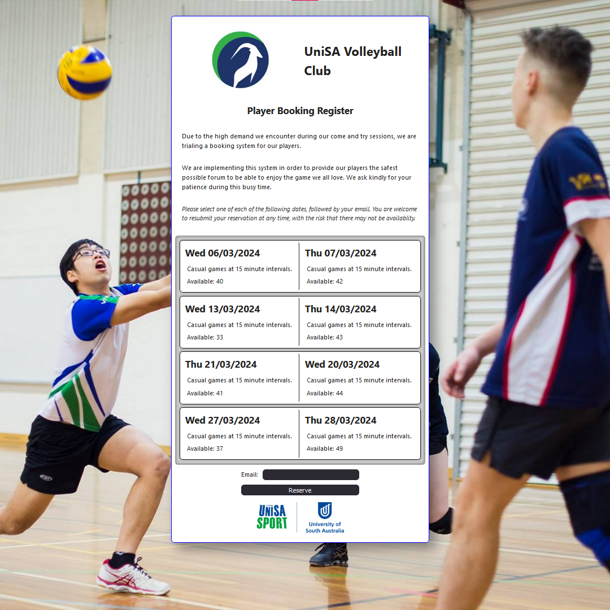

# unisa court booking system

 

[View the Project](https://connorturlan.github.io/unisa-court-booking/)

## MVP

Allow a user to select which days they wish to participate socially with the club.

<!-- ## Implementation -->

## Related Projects

- [React File Server](https://github.com/connorturlan/file-server-react) - A File Server front-end build to work with the provided File Server.

- [UniSA Membership Verifier](https://github.com/connorturlan/unisa-membership-verification) - A web tool to verify user emails.

## License

Copyright, TBD - no derrivitives.

## Contributions

Made by Connor Turlan 2024.
